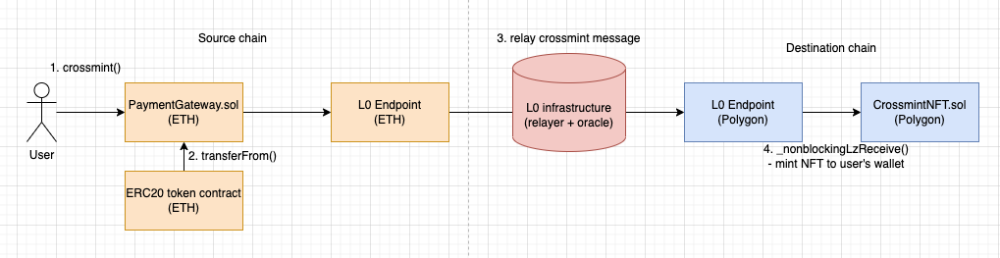

# Cross-chain nft minting

This project demonstrates cross-chain nft minting using LayerZero.

<p align="center">
  
</p>


## Demo Link 🔗
https://crosschain-nft-minting-frontend.vercel.app/

## Crossmint.sol

1. Deploy ERC20Mock, PaymentGateway, CrossmintNFT:

```
npx hardhat --network goerli deploy --tags ERC20Mock
npx hardhat --network goerli deploy --tags PaymentGateway
npx hardhat --network mumbai deploy --tags CrossmintNFT
````

2. Set the remote addresses, so each contract can receive messages
```angular2html
npx hardhat --network goerli setTrustedRemote --target-network mumbai --local-contract PaymentGateway --remote-contract CrossmintNFT
npx hardhat --network mumbai setTrustedRemote --target-network goerli --local-contract CrossmintNFT --remote-contract PaymentGateway
```

3. Mint mock ERC20 tokens
```angular2html
npx hardhat --network goerli mintERC20
```

4. Crossmint NFT from `goerli` to `mumbai` !
```angular2html
npx hardhat --network goerli crossmint --target-network mumbai
```
